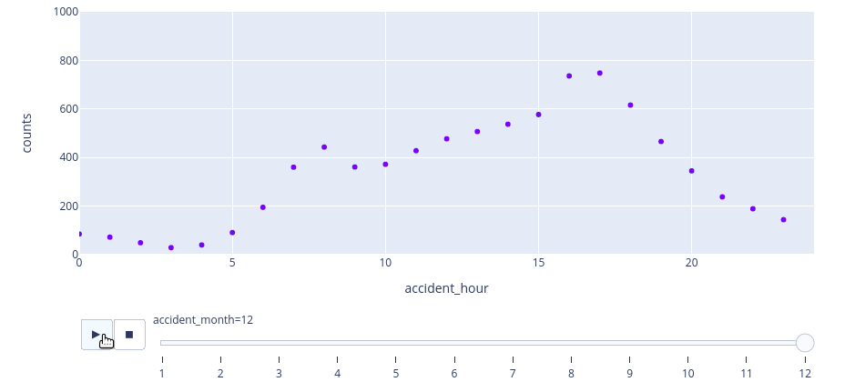

# Reducing the number of high fatality accidents in Great Britain

## Fictional scenario
I work at the department of Transport and am part of a team responsible for analyzing data from accidents in the year 2020. The final goal is to present strategies to reduce the number of high fatality accidents (defined bellow).

*Even though the data used in this project is real, the scenario **is not**. So my suggestions are only made as an exercise and should not be interpreted as any actual advise on road surveillance or public strategies.*

## 🦺 Motivation
An enormous effort is being made here at the Department of Transport to gather, and make public, data on road safety. Our reporting team has a collection fo files on every accident that is reported in *Great Britain* since 1979. According to our official Open Data page:

> These files provide detailed road safety data about the circumstances of personal injury road accidents in GB from 1979, the types of vehicles involved and the consequential casualties. The statistics relate only to personal injury accidents on public roads that are reported to the police, and subsequently recorded, using the STATS19 accident reporting form.

In this report, we at the *Road Safety Team* analyze data from 2020 to learn more about major incidents and their characteristics. We classify **major incidents** as being **fatal accidents involving 3+ casualties**.

Throughout the presented analysis, we will get some numbers on the time of occurrence of major incidents, their frequency and distribution across this one year period. We finish the report with our recommendations and main insights from the analysis.

## 💾 The data
The reporting department have been collecting data on every accident that is reported. They've included this along with a lookup file for 2020's accidents.

*Published by the department for transport. https://data.gov.uk/dataset/road-accidents-safety-data* 
*Contains public sector information licensed under the Open Government Licence v3.0.*

## Report
The entire analysis process is inside the notebook found [here](notebook-final.ipynb).

## Sneak peek

Using Plotly, we created an animation of the number of accidents by hour of day. The frames in the animation represent the month of the year. Notice the HUGE drop in the number of accidents in March-April (when social isolation started due to COVID-19).

